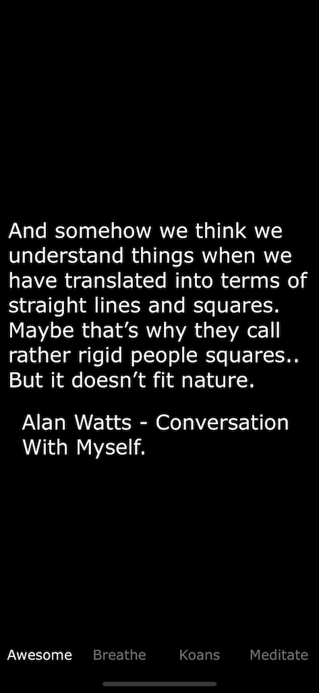
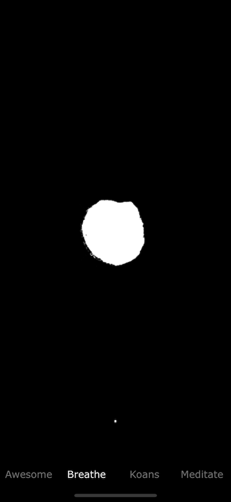
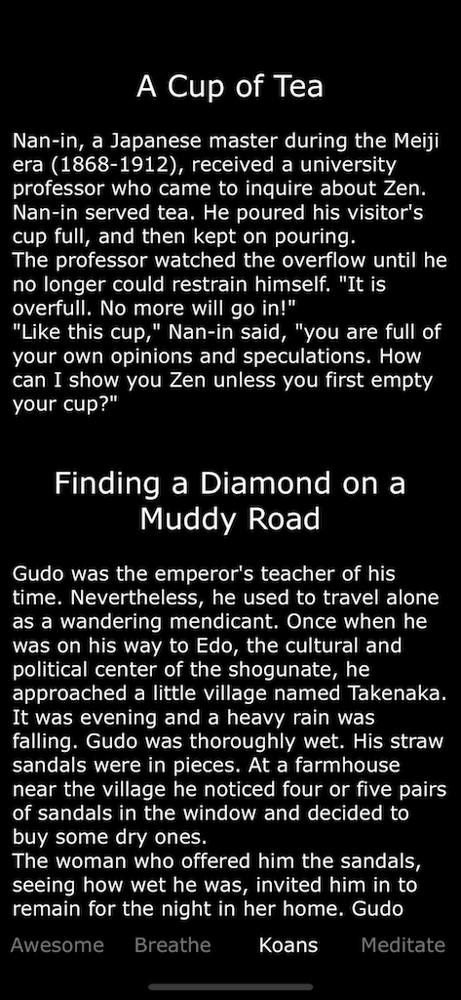
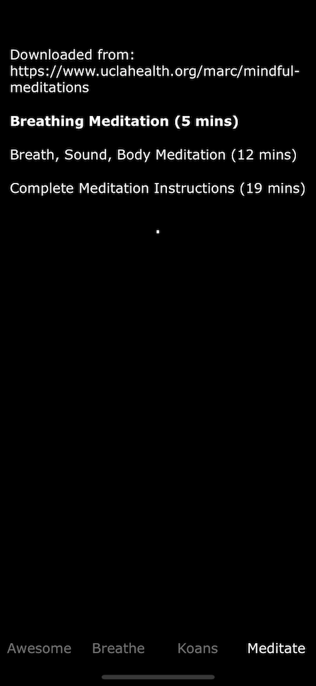

## just remind yourself you are awesome if you feel sad (or not)

# not any more

has 4x4x4x4 breathing

inhale 4 seconds
hold 4 seconds
exhale 4 seconds
wait 4 seconds

you can get it from the app store at [https://itunes.apple.com/us/app/be-awesome/id1387288406](https://itunes.apple.com/us/app/be-awesome/id1387288406) when it is approved

## credit

* logo 
Icons made by <a href="https://www.flaticon.com/authors/skyclick" title="Skyclick">Skyclick</a> from <a href="https://www.flaticon.com/" title="Flaticon">www.flaticon.com</a> is licensed by <a href="http://creativecommons.org/licenses/by/3.0/" title="Creative Commons BY 3.0" target="_blank">CC 3.0 BY</a>

* music from: https://freemusicarchive.org/genre/Ambient/?sort=track_interest http://freemusicarchive.org/music/Kai_Engel/ and http://freemusicarchive.org/music/Chris_Zabriskie/
* meditation files from: https://www.uclahealth.org/marc/mindful-meditations
* Alan Watts - Conversation With Myself: https://archive.org/details/AlanWattsSpeeches
